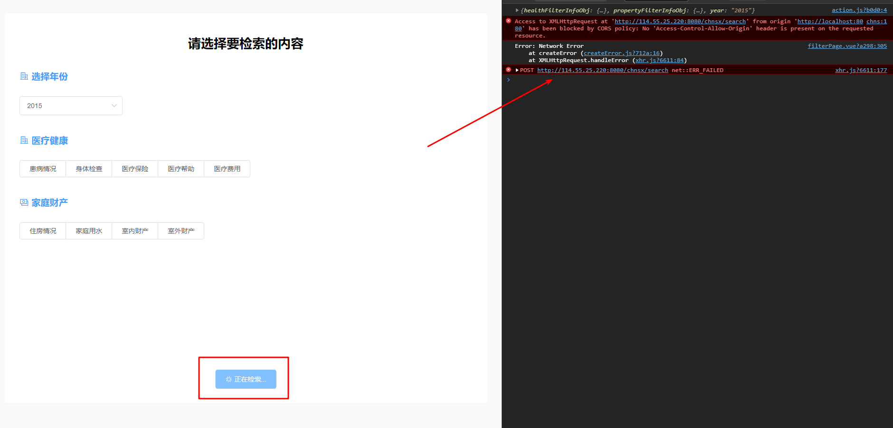

# 微观中国（CHNS）项目前端开发

> 项目描述：该项目为[微观中国](https://www.cpc.unc.edu/projects/china/data/questionnaires)的前台页面展示部分。
>
> 在线DEMO：[在线演示](https://www.chenmo1212.cn/chns)
>
> - 注意：在线DEMO数据为模拟数据，并非真实数据，并未与后端进行连接。
>
> 技术栈： `Vue.js(2.0)`; `vuex`; `vue-router`; `axios`; `Echarts.js`; `Element-UI`;

## 项目启动

``` bash
# 克隆项目到本地
git clone https://github.com/chnsx/chnsx-frontend.git

# 安装项目依赖
## 如果npm速度慢可以考虑使用cnpm安装：cnpm install
## 项目使用到了vue-router,vuex,axios,echart,element-ui,请务必确保上述插件已安装
npm install

# 运行热更新服务到 localhost:8080/chns
## 由于demo演示在我个人主页的子目录，因此并非为默认的localhost:8080，而是localhost:8080/chns；若想要修改，在router.js文件中把所有的/chns删掉即可
npm run dev

# 打包项目
npm run build
```

## 分支介绍

- master：项目初始分支，由[Iceberry-qdd](https://github.com/Iceberry-qdd)完成，为项目雏形。
- cw：项目优化分支，由[VanHelsingcw](https://github.com/VanHelsingcw)基于`master`分支重新开发优化而成。
- main：项目目前主要分支，由[Chenmo1212](https://github.com/Chenmo1212)重构`cw`分支而成，目前为项目的主要内容分支，主要更新内容都在这个分支。

## 项目现存问题

概况：由于该项目仅刚接手一周时间，对于从明白需求到完成实现需求而言，时间较为紧迫。且项目在目前阶段主要任务为申请软著，项目原型在设计部分存在诸多不合理之处，前端已尽力合理化，但仍存在些许问题，因此在许多细节方面不过多深究。但为了项目后续发展，对项目现存问题做以较详细的概述。

现存问题根据优先级分为三类：**高，中，低**，修复难度分为：**大，中，小**。后续维护开发者可依据情况对相应问题进行处理。

### 优先级：高

#### 1. 检索条件标题缺失

> 描述：检索页面`家庭财产`一栏中筛选条件的标题出现缺失。


- 修复难度：**小**
- 解释：在前端页面中，当用户选择*家庭用水，室内财产，室外财产*时，出现多个下拉选择框，每个下拉选择框应当有与内容对应的小标题（否则用户会不清楚自己选择的内容到底是在选择什么）。

- 修复思路：在`view/filterPage.vue`页面中的`DOM部分`增加小标题部分。需要注意的是，应当判断仅为*家庭用水，室内财产，室外财产*时才出现小标题（当然也可以为了统一性全局都加上小标题）。`Data部分`已经添加了标题字段：`itemName`，因此直接在`DOM`使用即可。

  

#### 2. 筛选结果页面翻页功能无效

> 描述：筛选结果页面当返回数据较多时，会出现分页器。用户点击不同分页时，应当跳转不同的数据。


- 修复难度：**中**
- 解释：目前筛选页面的分页效果只是一个摆设，理应与后端协调如何合理使用分页效果。用户点击指定页码，页面数据应当更新至相应页码数据。

- 修复思路：
  1. 思路一：**数据预加载**（用户体验最佳）
     1. 点击筛选页面开始检索时，向后端发送请求，此时后端返回**前60条**数据与**最后一页数据**，前端分割成**6页**，**一页10条**数据。
     2. 当用户点击1-6页任意一页时，向后端发送相应数据请求，时刻保持当前页面前三页与后三页的数据都已提前加载在本地。举例：当用户点击第6页时，前端需要向后端请求第7,8页的数据进行预加载。
  2. 思路二：**中规中矩型**
     1. 点击筛选页面开始检索时，向后端发送请求，此时后端返回**前10条**数据。
     2. 用户点击第几页就向后端发送第几页数据的请求。
  3. 思路三：**一劳永逸型**
     1. 点击筛选页面开始检索时，向后端发送请求，此时后端返回**所有数据**。
     2. 用户点击第几页就向前端就显示第几页数据。

#### 3. 家庭详细信息页面文字内容有误

> 描述：家庭详细信息页面中**医疗情况**的描述文字有误，应当针对该家庭进行描述，而非对所有家庭。


- 修复难度：**低**
- 解释：家庭详细信息页面中**医疗情况**的描述文字有误，应当针对该家庭进行描述，而非对所有家庭。

- 修复思路：
  1. 让后端返回完整的正确的文字。
  2. 后端返回部分文字，前端再拼接。

#### 4. 请求异常处理

> 描述：向后端发送请求出现异常，前端应当有对应的提示。



- 修复难度：**低**
- 解释：前端所有对后端发送请求的部分，应当对请求异常进行捕捉，并对不同异常对用户做出不同的提示。

- 修复思路：在`app.vue`中添加一个提示框，将是否**显示变量**绑定到`vuex`。在所有的发送请求`catch部分`修改提示框显示变量，从而控制提示框是否显示与显示什么内容。


### 优先级：中

#### 1. vuex使用问题

> 描述：在通过mapState和mapAction使用vuex时会访问不到


- 修复难度：**中**
- 解释：通过引入vuex进行访问vuex中state的数据，出现访问不到的情况。但是通过this.$store.state却又可以访问。

- 修复思路：用法确定没有错误，[官网](https://vuex.vuejs.org/zh/guide/state.html)中也指明可以使用**对象展开符**进行使用，但应当是哪个部分出现了差错所以导致无法使用。

#### 2. 检索部分应当添加路由守卫

> 描述：用户直接输入检索结果页面的`url`就可以访问检索结果页面，在逻辑上是不允许的，因此需要添加路由守卫防止用户通过`url`进行跳转。

- 修复难度：**中**
- 解释：筛选结果页面应当是由筛选页面跳转进入。若用户直接输入筛选结果页面的`url`，逻辑上应当是强制重定向到筛选页面。

- 修复思路：`Vue`的[路由守卫](https://router.vuejs.org/zh/guide/advanced/navigation-guards.html)可以防止用户通过url进行跳转。


### 优先级：低

#### 1. 前端文字字号不统一

> 描述：前端各个页面文字字号不统一的问题


- 修复难度：**低**
- 解释：前端各个页面**文字字号不统一**的问题

- 修复思路：app.vue中定义全局文字样式，组件内直接使用对应类名即可。

## 项目提示

> 描述：项目中可能会发生诸多bug，这里仅对部分bug作为一个记录和提示作用。

### 1. 页面出现Can not Get

- 若项目运行无报错，且控制台已提示服务运行URL，但是访问时页面中出现`Can not Get`字样，原因可能是`config`文件夹中的`index.js`文件里的`assetsPublicPath`字段值为：**‘./’**，将其改为 **‘/’** 即可。具体原因这里不过多解释，百度即可。

### 2. vue项目严格模式

- 为规范代码，**该项目已开启代码严格模式**，因此在开发过程中，请严格遵守编码规范，否则运行或者打包时均会报错提示。
- 即使是多了一个不该的分号和逗号，或者滥用引号都会提示报错。
- 严格模式可以关闭，关闭流程自行百度。

### 3. 全站模拟数据

- 由于前端和后端部署在不同的服务器，因此在服务器端进行访问时会出现前端常见的`跨域`问题。解决方案并不难，后端服务器上简单处理极客，但目前的后端应当是没有精力，因此前端全站均使用的模拟数据。
- 尽管全站模拟，但是所有关于连接后端的接口已使用`axios`全部写好，后续若要使用，可仿照已写好的接口继续撰写。**若要使用接口，注释掉对应部分即可**。代码不难，若不懂则需要补救前端知识。

### 4. Echart代码封装

- Echart代码目前仅在之前代码的基础上做了简单修改。但可见代码的封装性不够完善，后续开发若有余力，可以考虑将Echart部分代码进行封装完善。

### 5. 接口代码冗余

- 全站有多个地方功能相似，但代码却各有千秋，原因是同一个功能后端却返回不同的数据，前端没有办法，只能根据后端返回的数据再进行相应处理。后续若有余力，应当和后端进行协调，让后端把接口与**返回的数据进行规范化处理**。


## 结尾

> 尽人事，听天命。

世上有太多事情无法预料，也无法掌控，能做的，只是把自己分内的事情做好。**前路漫漫，当克己，当慎独。**


—— 2021-05-18

—— 陈默